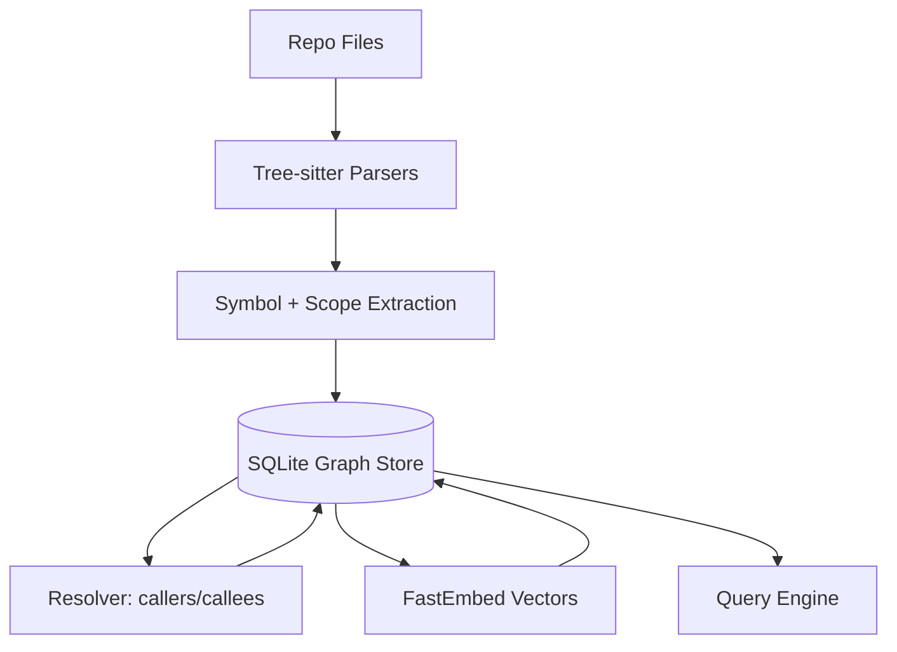

# Coderev

[](https://opensource.org/licenses/MIT)
[](https://github.com/been-there-done-that/coderev/actions)
[](https://github.com/been-there-done-that/coderev/releases)

**Coderev builds a verified semantic code graph so you can search, trace, and reason about code like a compiler would.**

Coderev is a local-first engine that parses your repository, resolves symbol relationships, and stores a queryable graph in SQLite. It adds AI-assisted search on top of real call graphs—so results are grounded in your codebase, not just text similarity.

---

## ⚡ Quick Start

Get up and running in seconds:

```bash
# Install via Homebrew
brew tap been-there-done-that/coderev && brew install coderev

# Or install from source
cargo install --path .

# Index your first project
coderev index --path ./my-awesome-project
```

---

## 🔥 Key Highlights

| Feature | Description |
| :--- | :--- |
| **Compiler-Grade Graph** | Symbols, definitions, references, callers, and impact paths. |
| **Local AI Search** | Semantic search over real symbols and their implementation context. |
| **MCP Ready** | Connect AI agents via the Model Context Protocol in one command. |
| **Live Indexing** | Watch mode keeps your graph fresh as you type. |
| **SQLite Substrate** | An open, inspectable store to build your own custom tools. |

---

## 📖 Documentation

Explore the comprehensive guides to get the most out of Coderev:

- 🚀 **[Getting Started](docs/getting-started.md)**: Installation, first index, and basic usage.
- 🤖 **[MCP Guide](docs/mcp-guide.md)**: Integrating AI agents like Claude and ChatGPT.
- 🛠️ **[CLI Reference](docs/cli-reference.md)**: Full command and flag documentation.
- 🏗️ **[Architecture](docs/architecture.md)**: Deep dive into the technical internals.
- 📊 **[Benchmarks](docs/benchmarks.md)**: Reproducible performance comparisons.

---

## 🗺️ How It Works

Coderev builds an end-to-end code intelligence pipeline on your local machine:



---

## 🌍 Language Support

| Tier | Languages | Capability |
| :--- | :--- | :--- |
| **Tier 1** | Python | Full AST resolution, deep symbol graph. |
| **Tier 2** | Rust, JS, TS, Go | Baseline parsing, call graph extraction. |
| **Tier 3** | All others | Semantic search via smart chunking. |

---

## 🤝 Contributing

Contributions are welcome! Please check our **[Architecture guide](docs/architecture.md)** to understand the core engine before submitting PRs.

## 📄 License

MIT © [Been There Done That](https://github.com/been-there-done-that)
