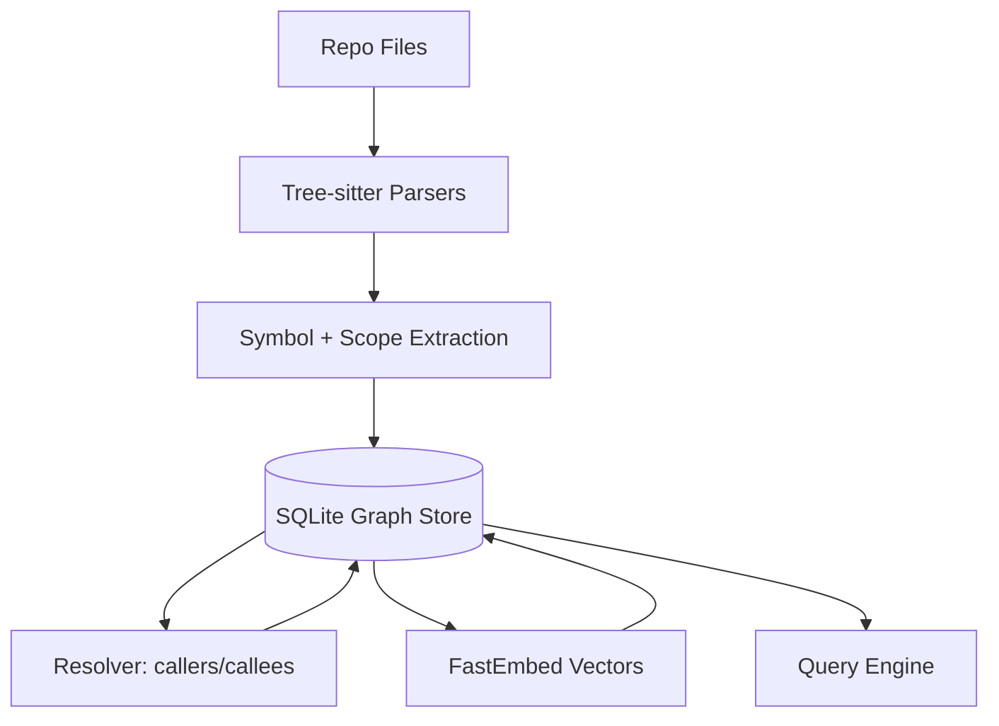
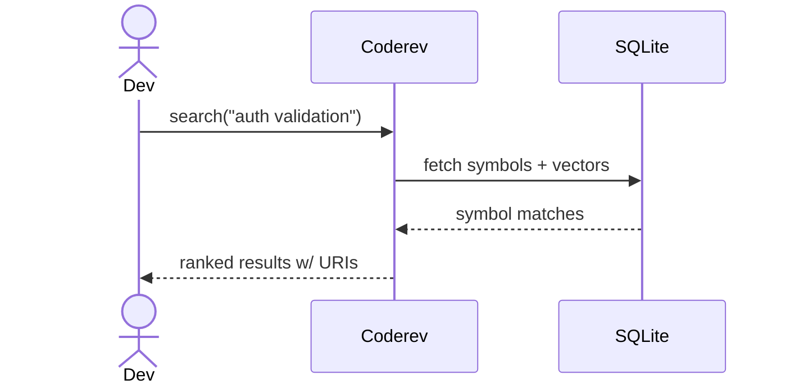

# Coderev — Universal Code Intelligence Substrate

**Coderev builds a verified semantic code graph so you can search, trace, and reason about code like a compiler would.**

Coderev is a local-first engine that parses your repository, resolves symbol relationships, and stores a queryable graph in SQLite. It adds AI-assisted search on top of real call graphs — so results are grounded in your codebase, not just text similarity.

---

## Highlights

- **Compiler-grade graph**: Symbols, definitions, references, callers, callees, and impact paths.
- **Local AI search**: Semantic search over real symbols and their implementation context.
- **MCP-ready**: Connect AI agents via the Model Context Protocol.
- **Live indexing**: Watch mode keeps your graph fresh.
- **SQLite substrate**: Build your own tooling on top of an open, inspectable store.

---

## Why Coderev

Coderev isn’t “just another semantic search.” It’s **graph‑grounded retrieval**:
- **Verified structure**: Callers, callees, and impact paths come from a semantic graph, not guessed from chunks.
- **Better LLM context**: Symbols and relationships map to how engineers reason about code.
- **Local‑first + deterministic**: You can inspect and trust the substrate.

See `WHY_Coderev.md` for a concise positioning and benchmark highlights.

---

## What Coderev Supports

### Language Coverage

- **Deep AST support**: `Python`
- **Baseline parsing**: `JavaScript`, `TypeScript`, `Rust`, `Go`
- **Semantic fallback**: All other text-based files are indexed via chunking to keep full repository coverage.

### Interfaces

- **CLI**: Index, search, trace, impact, resolve, stats
- **MCP server**: AI agent integration over stdio
- **HTTP server + UI**: Local UI served by `coderev serve`

---

## Quick Start

### 1) Index a repository

```bash
cargo run -- index --path /path/to/your/project --database coderev.db
```

### 1.5) Optional: create a config file

```bash
cargo run -- init --path /path/to/your/project
```

This writes `coderev.toml` so you can omit `--path` and `--database` later.  
By default the database is stored at `.coderev/coderev.db`, and `.coderev/` is added to `.gitignore`.

## Installation (From Source)

### macOS / Linux

```bash
./install.sh
```

### Windows (PowerShell)

```powershell
./install.ps1
```

### 2) Search semantically

```bash
cargo run -- search --query "how does auth work?"
```

### 3) Trace callers / callees

```bash
cargo run -- callers --uri "codescope://my-repo/src/auth.py#callable:validate_login@10"
```

---

## How It Works (Illustrated)

### End-to-end pipeline



### Query flow



---

## CLI Reference (Core)

| Command | Purpose |
| :--- | :--- |
| `index` | Parse → resolve → embed your repository. |
| `init` | Create `coderev.toml` for default paths and database. |
| `search` | Semantic or exact search over symbols. |
| `embed` | Generate embeddings (default model: `all-MiniLM-L6-v2`). |
| `callers` / `callees` | Traverse the verified call graph. |
| `impact` | BFS traversal for change impact analysis. |
| `resolve` | Resolve deferred references after indexing. |
| `stats` | Inspect index and symbol coverage. |
| `watch` | Incremental updates on file change. |
| `serve` | Serve API + UI locally. |
| `mcp` | Start MCP server over stdio. |
| `trace callers|callees` | Alias for callers/callees. |

---

## Structured Output (Automation-Friendly)

Coderev can emit stable, predictable output for scripts and agents:

- `--json` — versioned schema (`schema_version: "1"`).
- `--compact` — same data with shorter keys.
- `--toon` — same as compact, just with a funnier name. We support TOON because why not.

---

## Configuration

Coderev reads `coderev.toml` from the project root when present.

```toml
database = ".coderev/coderev.db"
repo = "my-repo"
path = "."
```

---

## Agent Setup (MCP)

Generate MCP config scaffolding for agents:

```bash
cargo run -- agent-setup --path /path/to/your/project
```

This writes `.coderev/mcp.json` pointing to `coderev mcp --database .coderev/coderev.db`.

---

## MCP Integration

Coderev implements the **Model Context Protocol (MCP)** so AI agents can query your codebase directly.

```bash
cargo run -- mcp --database coderev.db
```

MCP tools include:
- `search_code`
- `get_callers`
- `get_callees`
- `get_impact`

---

## UI (Local)

Run the local UI + API server:

```bash
cargo run -- serve --database coderev.db
```

UI assets live in `ui/` and are served by the backend when built.

---

## Watcher Daemon

Run in the background:

```bash
cargo run -- watch --background
```

Check status / stop:

```bash
cargo run -- watch --status
cargo run -- watch --stop
```

Daemon state lives in `.coderev/` (`coderev-watch.pid`, `coderev-watch.log`).

---

## Benchmarking

Reproducible benchmark suite (Coderev vs coderev vs rg vs RAG):

```bash
bench/run_all.sh
python3 bench/report.py
```

Outputs:
- `bench/results/` (raw artifacts)
- `bench/REPORT.md` (summary table)

---

## Design Principles

- **Grounded graph first**: No hallucinated relationships.
- **Local-first**: Everything runs on your machine.
- **Composable substrate**: The SQLite schema is the stable foundation.

---

## Repository Layout

- `src/` — Rust core (indexing, graph, resolver, query)
- `ui/` — Svelte UI
- `queries/` — query logic and experiments
- `test_*` — fixtures and test data

---

## Contributing

Contributions welcome — especially in:
- JS/TS/Rust/Go adapters
- Incremental indexing performance
- Vector index acceleration
- UI polish and usability

---

## License

MIT
