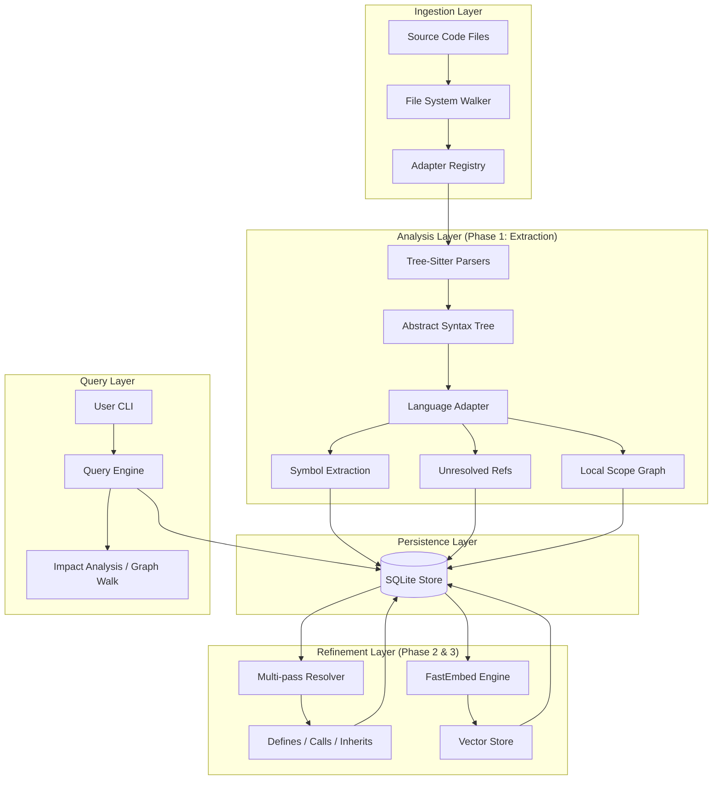

# 🏗️ Coderev Architecture: Universal Code Intelligence Substrate

Coderev is a multi-stage pipeline that transforms raw source code into a queryable semantic graph with local AI vector search capabilities.

## 1. High-Level System Design

## 2. Core Implementation Pillar

### Phase 1: AST-Native Extraction
Unlike regex-based tools, Coderev uses **Tree-sitter** to perform deep syntactic analysis. This allows the system to understand:
- **Decorated Definitions**: Handling `@decorator` logic in Python.
- **Async/Await**: Accurate signature extraction for non-standard function prefixes.
- **Contextual Scope**: Distinguishing between a variable name in a function and a class property.

### Phase 2: The Multi-pass Linker
Name resolution happens in two stages:
1. **Local**: Names defined within the same file are linked immediately.
2. **Global**: References that cannot be resolved locally are stored as `UnresolvedReference` and resolved after the entire repository has been indexed into the SQLite database.

### Phase 3: Local AI (Private & Fast)
Coderev integrates **FastEmbed** to run local transformer models (`all-MiniLM-L6-v2`).
- **Semantic Search**: Traditional keyword search is augmented with vector similarity.
- **Context-Aware**: Embeddings are generated using the symbol name, its signature, and a preview of its implementation content.

## 3. Current Feature Set (CLI)
- `index`: Full repository scanning and AST parsing.
- `embed`: Batch generation of vector embeddings (Local ONNX).
- `search [--vector]`: Semantic or keyword search across the codebase.
- `callers / callees`: Traversal of the function call graph.
- `impact`: BFS analysis to determine the "blast radius" of a code change.
- `stats`: Real-time database health and index density reporting.

## 4. Roadmap & Gaps

| Feature | Status | Description |
| :--- | :--- | :--- |
| **Python Adapter** | ✅ High | Full Tree-sitter support for definitions/calls. |
| **JS/TS Adapter** | ⚠️ Basic | Scaffolded with file-level indexing. Needs AST walk. |
| **Incremental Indexing** | ❌ Missing | Needs file hashing to avoid full re-scans. |
| **Standard Lib Resolution** | ❌ Missing | Does not follow calls into third-party packages. |
| **LSP Export** | ❌ Missing | Converting the graph into an LSP-compatible format. |

## 5. How to Contribute

### Adding a New Language
1. Add the `tree-sitter-<language>` crate to `Cargo.toml`.
2. Create a new adapter in `src/adapter/<language>.rs` implementing the `LanguageAdapter` trait.
3. Register it in `src/adapter/framework.rs`.

### Improving Search Performance
The current vector search uses a linear scan in Rust. Contributing a **HNSW** index or a specialized SQLite vector extension would significantly increase performance for large-scale monorepos.

---
*Created by Coderev Development Team* 🚀
